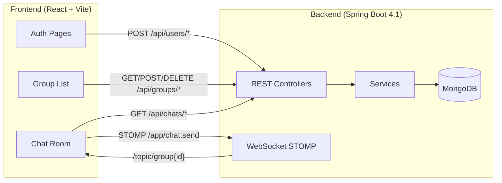
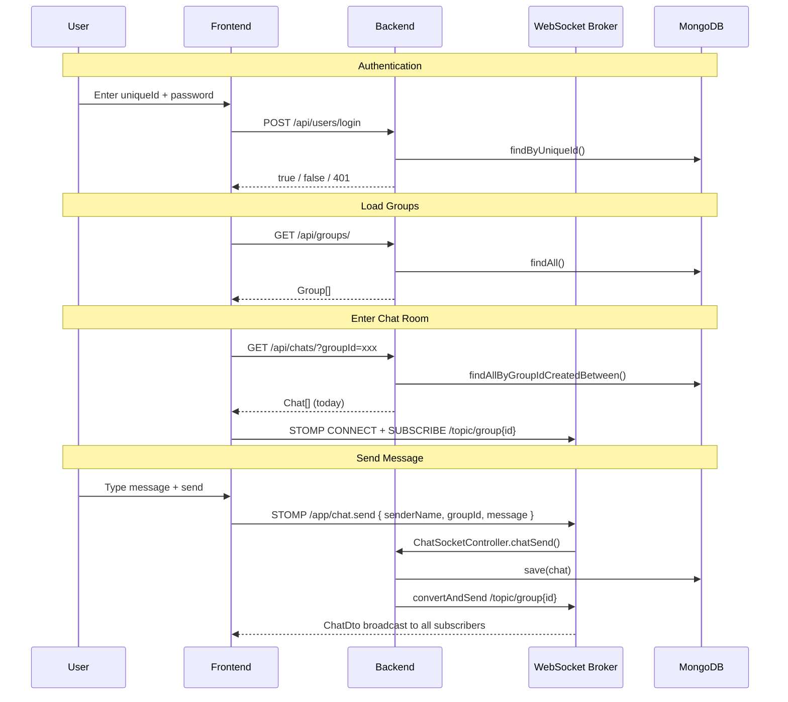

# LANChat — Frontend UI Implementation Guide

> Complete integration documentation derived from reading every backend source file.

---

## 1. Architecture Overview



**Backend port**: `8080` (default Spring Boot)  
**Frontend port**: Vite dev server (typically `5173`) — needs a proxy to `8080`

---

## 2. REST API Contract

### 2.1 Authentication

#### `POST /api/users/create` — Sign Up

| Field | Type | Validation |
|---|---|---|
| `uniqueId` | `string` | **Must start with `727723EUIT`** |
| `name` | `string` | Display name |
| `password` | `string` | Stored BCrypt-hashed |

```json
// Request
{ "uniqueId": "727723EUIT042", "name": "Kiruthik", "password": "secret123" }

// Response: true (boolean) on success
```

> [!WARNING]
> If `uniqueId` doesn't start with `727723EUIT`, the backend throws `InvalidUniqueIdException` → **400 Bad Request**.

---

#### `POST /api/users/login` — Login

| Field | Type | Notes |
|---|---|---|
| `uniqueId` | `string` | Registered college ID |
| `password` | `string` | Raw password (BCrypt matched server-side) |

```json
// Request
{ "uniqueId": "727723EUIT042", "password": "secret123" }

// Response: true (boolean) if credentials match, false if password wrong
```

> [!IMPORTANT]
> If the `uniqueId` doesn't exist at all, backend throws `UserUnauthorizedException` → **401 Unauthorized**.  
> The backend returns `true`/`false` — it does NOT return a JWT token. Auth is stateless; store `uniqueId` and `name` in localStorage on the client.

---

### 2.2 Groups

#### `GET /api/groups/` — List All Groups

```json
// Response: Array of Group objects
[
  {
    "id": "6841abc...",           // MongoDB _id
    "groupId": "a1b2c3d4-...",   // UUID
    "groupName": "Study Group",
    "createdAt": "2026-06-29T10:00:00",
    "updatedAt": "2026-06-29T10:00:00"
  }
]
```

---

#### `POST /api/groups/create` — Create Group

```json
// Request body
{ "groupName": "New Group" }

// Response: the created Group object (same shape as above)
```

---

#### `DELETE /api/groups/delete?groupId={uuid}&userId={uniqueId}` — Delete Group

| Param | Type | Notes |
|---|---|---|
| `groupId` | query string | The UUID of the group |
| `userId` | query string | The `uniqueId` of the requesting user |

> [!CAUTION]
> **Master check**: The backend calls `userRepository.existsByUniqueId(userId)`. If the user is not a registered user → **403 Forbidden** (`UserUnauthorizedException`).  
> If the group doesn't exist → **404 Not Found** (`GroupNotFoundException`).

```json
// Success response: "Successfully deleted group" (plain string)
```

---

### 2.3 Chats (REST — for history loading)

#### `GET /api/chats/?groupId={uuid}` — Today's Chats

Returns chats where `createdAt` is between today's `00:00:00` and `23:59:59`.

```json
// Response: Array of Chat entities
[
  {
    "id": "...",
    "name": "Kiruthik",       // sender display name
    "groupId": "a1b2c3d4-...",
    "message": "Hello!",
    "expiresAt": "2026-06-30T10:30:00",
    "createdAt": "2026-06-29T10:30:00",
    "updatedAt": "2026-06-29T10:30:00"
  }
]
```

> [!NOTE]
> Chat documents have a MongoDB TTL index on `expiresAt` set to `1d` — messages auto-delete from the database after 1 day.

---

#### `GET /api/chats/all?groupId={uuid}` — All Chats (ordered by `createdAt` ASC)

Same response shape. Throws `GroupNotFoundException` if no chats found for group.

---

### 2.4 Error Response Shape

All errors return this JSON body:

```json
{
  "timestamp": "2026-06-29T10:30:00",
  "status": 400,           // HTTP status code
  "error": "Bad Request",  // HTTP reason phrase
  "message": "Unique Id must be collegeId"  // Custom message
}
```

| Exception | HTTP Status |
|---|---|
| `InvalidUniqueIdException` | 400 |
| `UserUnauthorizedException` | 401 (login) / 403 (delete) |
| `GroupNotFoundException` | 404 |
| `RuntimeException` (generic) | 500 |

---

## 3. WebSocket (STOMP) Contract

### 3.1 Connection

| Setting | Value |
|---|---|
| **Endpoint** | `/websocket` |
| **Protocol** | STOMP over SockJS |
| **Allowed Origins** | `*` (all) |

```javascript
// Using @stomp/stompjs + sockjs-client
import { Client } from '@stomp/stompjs';
import SockJS from 'sockjs-client';

const client = new Client({
  webSocketFactory: () => new SockJS('http://localhost:8080/websocket'),
  onConnect: () => { /* subscribe to topics */ },
});
client.activate();
```

### 3.2 Sending a Message

**Destination**: `/app/chat.send`  
**Payload** (`ChatDto`):

```json
{
  "groupId": "a1b2c3d4-...",
  "senderName": "Kiruthik",
  "message": "Hello everyone!"
}
```

> [!IMPORTANT]
> The field is `senderName` (not `name`). The backend [ChatMapper](file:///e:/PROJECTS/LANChat/Backend/src/main/java/com/lanchat/mapper/ChatMapper.java) maps `senderName` → entity `name` on save, and back to `senderName` on broadcast.

### 3.3 Receiving Messages

**Subscribe to**: `/topic/group{groupId}`  
Example: `/topic/groupa1b2c3d4-...`

> [!NOTE]
> There is **no space or slash** between `group` and the UUID. The backend broadcasts to `"/topic/group" + chatDto.getGroupId()`.

**Received payload** (`ChatDto`):

```json
{
  "id": "6841def...",
  "groupId": "a1b2c3d4-...",
  "senderName": "Kiruthik",
  "message": "Hello everyone!",
  "createdAt": "2026-06-29T10:30:00"
}
```

---

## 4. UI Screens & Component Map

### Screen 1: Login / Sign Up

| Element | Details |
|---|---|
| **Unique ID input** | Text field — validate prefix `727723EUIT` client-side |
| **Name input** | Only on Sign Up |
| **Password input** | Password field |
| **Toggle** | Switch between Login / Sign Up mode |
| **Submit button** | Calls `POST /api/users/login` or `POST /api/users/create` |
| **Error display** | Show `response.message` from error body |
| **On success** | Store `{ uniqueId, name }` in `localStorage`, navigate to Groups |

---

### Screen 2: Group Lobby

| Element | Details |
|---|---|
| **Group list** | Fetch `GET /api/groups/` on mount — display `groupName` cards |
| **Create group** | Input + button → `POST /api/groups/create` with `{ groupName }` |
| **Delete group** | Icon button per group → `DELETE /api/groups/delete?groupId=...&userId=...` |
| **Enter group** | Click a group card → navigate to Chat Room with `groupId` |
| **Logout button** | Clear `localStorage`, navigate to Login |

---

### Screen 3: Chat Room

| Element | Details |
|---|---|
| **Header** | Group name + back button |
| **Message list** | On mount: fetch `GET /api/chats/?groupId=...` (today) or `GET /api/chats/all?groupId=...` |
| **Today toggle** | Switch between today-only and all-history endpoints |
| **WebSocket** | Connect on mount, subscribe to `/topic/group{groupId}` |
| **Message input** | Text input + send button |
| **Send** | `client.publish({ destination: '/app/chat.send', body: JSON.stringify(chatDto) })` |
| **Incoming message** | Append to message list from subscription callback |
| **Message bubble** | Show `senderName`, `message`, formatted `createdAt` timestamp |
| **Distinguish self** | Compare `senderName` with stored `name` from localStorage → right-align own messages |

---

## 5. Required npm Dependencies

```bash
npm install @stomp/stompjs sockjs-client react-router-dom
```

| Package | Purpose |
|---|---|
| `@stomp/stompjs` | STOMP client for WebSocket messaging |
| `sockjs-client` | SockJS fallback transport (matches backend config) |
| `react-router-dom` | Client-side routing between Login → Groups → Chat |

---

## 6. Vite Proxy Configuration

Add to [vite.config.js](file:///e:/PROJECTS/LANChat/Frontend/vite.config.js):

```javascript
export default defineConfig({
  plugins: [react()],
  server: {
    proxy: {
      '/api': 'http://localhost:8080',
      '/websocket': {
        target: 'http://localhost:8080',
        ws: true,
      },
    },
  },
});
```

---

## 7. Data Flow Summary



---

## 8. Key Implementation Notes

> [!TIP]
> **No JWT/Session auth** — the backend permits all requests (`anyRequest().permitAll()`). Store the logged-in user's `uniqueId` and `name` in `localStorage` and send `userId` as a query param only when deleting groups.

> [!NOTE]
> **Chat entity vs ChatDto field mapping** — The entity uses `name`, but the DTO uses `senderName`. The [ChatMapper](file:///e:/PROJECTS/LANChat/Backend/src/main/java/com/lanchat/mapper/ChatMapper.java) handles this conversion. When displaying REST-fetched chats (which return raw entities), use the `name` field. When displaying WebSocket-received messages (which return `ChatDto`), use `senderName`.

> [!IMPORTANT]
> **REST returns `Chat` entity, WebSocket returns `ChatDto`** — normalize these on the frontend:
> - REST `GET /api/chats/*` → `{ name, groupId, message, createdAt }`
> - WebSocket subscription → `{ senderName, groupId, message, createdAt }`
> - Map `name` ↔ `senderName` to a unified display field.

> [!WARNING]
> **Messages auto-expire** — The `expiresAt` TTL index means MongoDB will delete chat documents ~24 hours after creation. The "all chats" endpoint only returns what hasn't been garbage-collected yet.
